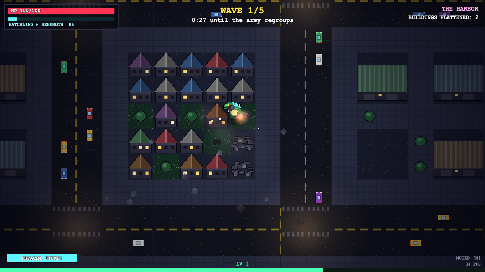
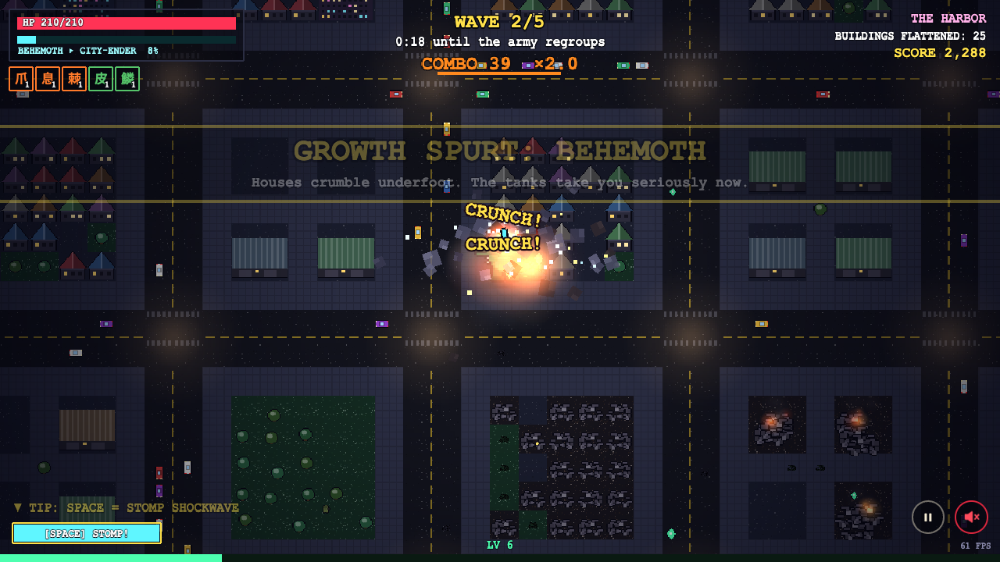
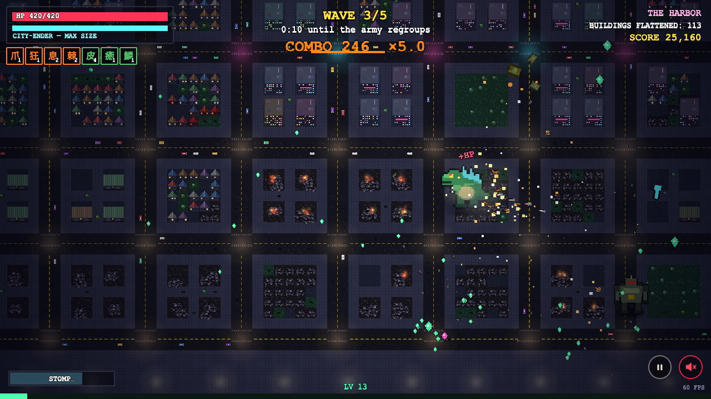
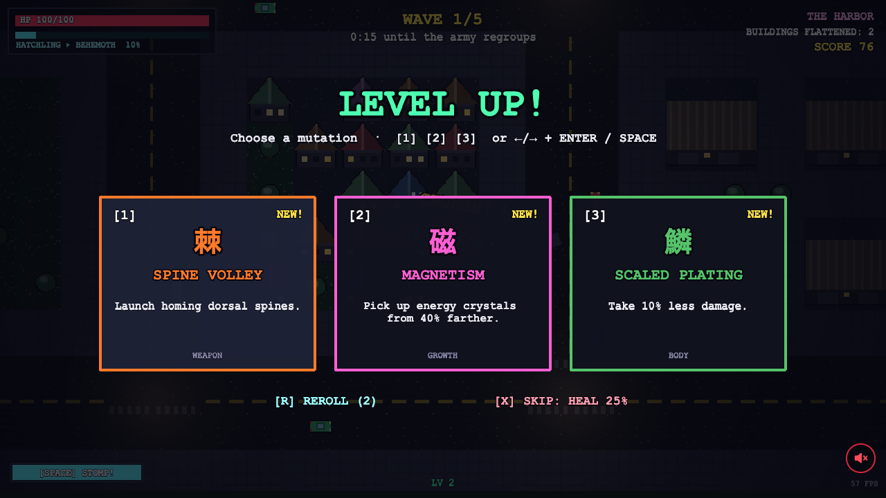
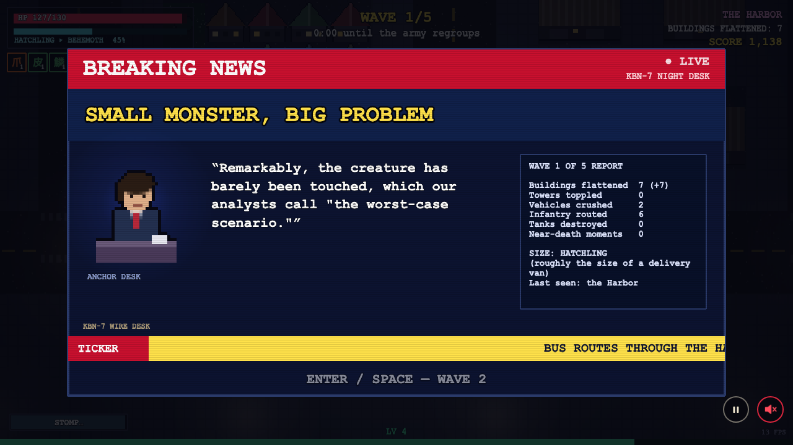
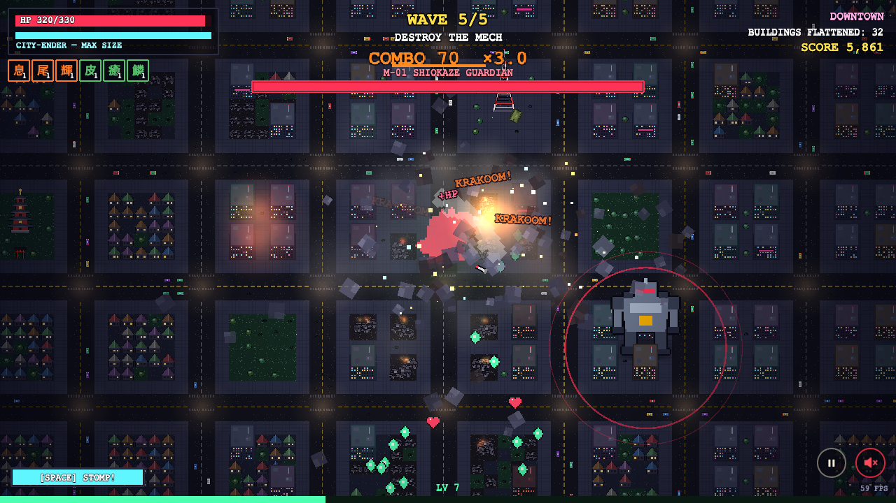

# Kaiju Rampage (vertical slice)

**Play it: https://kaiju.ryanseamons.com**

*Kaiju* (怪獣, Japanese for "strange beast") is the giant-monster genre: think a skyscraper-sized lizard wading out of the sea and flattening a city while the army fights back.

A browser survivor-like. You hatch in the bay as **TIDEMAW**, a van-sized lizard, and eat your way up to a city-ending monster across **3 size tiers** while the military throws infantry, tanks and finally a giant mech at you. Between waves the city reacts to *your* run with a **BREAKING NEWS** card: an anchor line plus a scrolling ticker built from your stats (buildings flattened, hardest-hit district, size, near-death moments, new abilities).

| Tier 1 · Hatchling | Tier 2 · Behemoth | Tier 3 · City-Ender |
|---|---|---|
|  |  |  |

| Level-up | Breaking news (shipped bank) | Final wave boss |
|---|---|---|
|  |  |  |

## Run it

Requires Node 22+.

```bash
npm install
```

```bash
npm run dev
```

Then open http://localhost:5173. `npm run dev` starts two processes: Vite (the game) and the tiny narration server on :8787 (`NARRATION_PORT` to change it), which Vite proxies at `/api`. The game works with no key and no server, because bulletins come from the shipped news bank. The title screen remembers your best run in `localStorage`.

A production build:

```bash
npm run build
```

`npm run preview` serves `dist/` on :4173 (run `npm run server` alongside it if you want the optional live-model path).

## Controls

| Input | Action |
|---|---|
| WASD / arrow keys (gamepad: left stick or d-pad) | Move |
| automatic | Claw swipe, plus any weapons you unlock |
| Space or Shift (gamepad: A) | **Stomp**: shockwave, 5s cooldown |
| 1 / 2 / 3, or ←/→ then Enter, or click (gamepad: d-pad + A) | Pick an upgrade on level-up |
| Enter (gamepad: A) | Start, dismiss the news card |
| P or Esc | Pause / resume |
| M, or the speaker button in the bottom-right corner | Mute / unmute everything (remembered between runs) |
| ←/→ on the title screen, or click | Difficulty: **Easy**, **Medium** (default) or **Hard** (remembered; the daily rampage is always Medium) |

**The loop:** crushing the city makes you **grow**; killing the military gives crystals that **level you up**. You crush on contact anything in your size class: cars and trees at tier 1, houses at tier 2, towers and tanks at tier 3. You can claw or shoulder-charge things one class bigger. Anything larger is a wall. Each tier zooms the camera out, heals you, and changes how the army behaves: at tier 1 infantry advance and shoot, at tier 2 they panic and tanks become the main threat, and at tier 3 tanks keep their distance and shell you from afar. There are 5 waves (about 10 minutes); wave 5 ends when you destroy the mech **M-01 Shiokaze Guardian**.

**Difficulty.** Easy is the original tuning. Medium and Hard raise enemy HP and damage, spawn rates and caps, add elites (2 and 3 per wave), bring jets in from wave 3 and more often, field more cannon batteries and helicopters once you reach tier 3 (where you'd otherwise outgrow the army), add tier-3 damage, cut heart drops and level-up heals, and thicken the encirclement ring. Score is ×0.75 on Easy, ×1 on Medium and ×1.5 on Hard, and the high-score table shows each run's mode. The knobs live in `src/difficulty.ts`.

There are 16 upgrades, offered 3 at a time: Serrated Claws, Long Reach, Frenzy, Atomic Breath, Tail Spin, Spine Volley, Fallout Aura, Thick Hide, Regeneration, Scaled Plating, Quickstep, Aftershock, Tectonic Rhythm, Magnetism, Growth Hormone and Rampage.

## The news desk (and where the key goes)

- **Default: the shipped news bank.** `src/shared/bank.ts` has 34 headlines, 123 anchor lines and 123 ticker fragments with slots (`{buildingsN}`, `{hardest}`, `{size}`, `{lowest}`, `{upgrade}`, …). Lines that state a count only fire when that count is non-zero, outcomes (wave cleared / victory / defeat) and tiers have their own lines, and no line repeats within a run. No key, no network, no cost.
- **Optional: a live model.** If the narration server sees an API key, it asks Claude for the bulletin instead. Put the key in a gitignored `.env` at the repo root, or export it before `npm run dev`:

  ```
  ANTHROPIC_API_KEY=sk-ant-...
  ```

  The key is read **only** by `server/index.ts`. The browser only ever calls `/api/bulletin` on its own origin, so the key never reaches the client bundle. At the start of each run the game checks `/api/health` once; unless the server reports a key, it never requests a bulletin at all. The default model is `claude-opus-5-5` at `medium` effort; override it with `NARRATION_MODEL` and `NARRATION_EFFORT`. The request starts about 22s before the wave ends so the break doesn't wait on it. If it isn't back within 2s of the break, or it fails or is refused, the card uses the bank. Measured cost is about $0.02–0.03 per bulletin, with 12–14s latency (see NOTES.md).
- **Tuning:** the prompt, the stats→prompt mapping (`describeStats`) and the bank selection all live in `src/shared/narration.ts`. The bank text is in `src/shared/bank.ts`, re-exported from there.

## URL parameters

| Param | Effect |
|---|---|
| `?seed=1234` | Fixed city layout and upgrade offers |
| `?fast=1` | Test speed: waves are 40% as long, and growth and XP are scaled up to match. Rules are unchanged, but it plays easier than normal because enemy pressure per second is the same. |
| `?startWave=5` | Debug: start at a later wave with that wave's expected size (for example, to see the boss) |
| `?mute=1` | No sound |
| `?difficulty=easy` | Force a difficulty (`easy`, `medium`, `hard`) for this load; the tests pin `easy` |
| `?daily=1` | Today's daily rampage (same city and upgrade rolls for everyone, Medium) |
| `?lang=ja` | Japanese UI |
| `?music=composed` | Use the procedural composer instead of the recorded tracks |
| `?renderer=canvas` | Force the Canvas renderer instead of WebGL |

## Tests

```bash
npx playwright install chromium
```

```bash
npm test
```

Playwright starts its own isolated servers: a mock Anthropic endpoint on :8790, a narration server without a key on :8791, a narration server with a fake key pointed at the mock on :8792, and Vite on :5174. A `npm run dev` you already have running is never touched.

| Spec | What it proves |
|---|---|
| `playthrough.spec.ts` | A scripted bot (keyboard input only; it reads a read-only `window.__kaiju.state()` snapshot to decide where to steer and which shells to sidestep) survives into wave 3 and reaches tier 3. It saves `tier1/2/3.png`, `levelup.png` and `bulletin-bank.png`, and asserts ≥15 upgrades, all 3 enemy types in the roster, infantry and tanks spawned, `source === 'bank'`, and that zero `/api/bulletin` requests were made without a key. |
| `ai-bulletin.spec.ts` | The optional live path works end to end against the mock with a fake key. It checks model `claude-opus-5-5`, effort `medium`, that the key header reaches the upstream, and that the card renders the model's text (`bulletin-ai.png`). |
| `bank.spec.ts` | The bank has ≥100 anchors and ≥100 tickers. Every template renders across 8 stat profiles with no unfilled slots, no "0 tanks" and no bad plurals; every template is reachable; a 5-wave run never repeats a line. |
| `boss.spec.ts` | `?startWave=5` spawns the mech (`boss.png`). |
| `teeth.spec.ts` | The military can hurt you: a kaiju that stands still in wave 2 at normal speed takes ≥40 damage within 35 s (it took 157 in the last run). |
| `live-ai.spec.ts` | Skipped unless `LIVE_NARRATION_URL` points at a narration server with a real key. |
| `pacing.spec.ts` | Skipped unless `PACING=1`: a normal-speed run that logs when each tier and wave is reached (`DIFFICULTY=medium`, `START_WAVE=3` to vary it). |
| `difficulty.spec.ts` | Skipped unless `DIFF=1`: a stationary kaiju at wave 2 (tier 2) and wave 4 (tier 3) on each difficulty; damage per game second must rise from Easy to Medium to Hard. |
| `sfx.spec.ts` | All 15 Kenney sample banks (and the Epidemic banks, when present) load and are audible on the master bus (recorded, not played aloud). |
| `music.spec.ts` | Skipped unless `MUSIC=1`: every music context is audible and unclipped; recorded tracks rotate and sit level with the composer. |

## Known gaps

- One kaiju, one biome, one run. There's no meta-progression, save or settings menu.
- Pathing is minimal: soldiers and tanks move straight at or away from you and sidestep when a building blocks them; they can still get briefly stuck in tight blocks.
- Balance is tuned against the bot plus a short manual play, not real playtests.
- An AI bulletin is written from stats about 22s before the wave ends, so its numbers can lag the stats box beside it.
- Music on the deployed site is 14 licensed Epidemic Sound tracks that rotate per stage (title, each tier, boss, victory, defeat). They're not in this repository, so a clone plays the procedural composer instead (see ASSETS.md). Effects are Kenney CC0 samples layered over WebAudio synthesis.
- Text uses the system `Courier New`/monospace font; no pixel font is bundled.
- The gamepad path uses Phaser's standard mapping and has only been checked in code, not with a physical pad.
- In headless Chromium (SwiftShader, no GPU) the game runs at about 15–30 FPS. On this laptop's browser it runs at about 140 FPS (see NOTES.md).
- `?fast=1` (used by the quick tests) plays easier than normal speed. Normal-speed balance is covered by the opt-in `pacing.spec.ts`, which won a full run in 14 minutes of wall-clock time.
